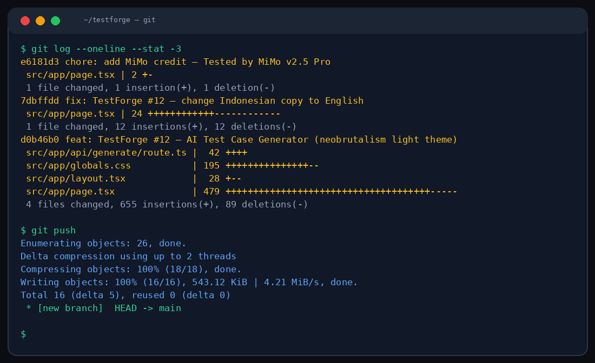

# 🧪 TestForge

**No cap.** Describe your feature in plain English → get structured test cases instantly. Supports unit, integration, e2e, and edge case generation.



## Why TestForge?

Writing test cases is boring. TestForge lets you describe what your feature does, and it generates comprehensive test suites covering happy paths, edge cases, and error scenarios.

## Features

- **Feature → Tests** — Describe a feature, get test cases
- **4 test types** — Unit, Integration, E2E, Edge Case
- **Structured output** — Test name, steps, expected result, priority
- **Export ready** — Copy individual tests or export full suite
- **Multiple frameworks** — Generates for Jest, Vitest, Cypress, Playwright

## Usage

```bash
npm install && npm run dev
# Open http://localhost:3000
```

1. Type your feature description
2. Select test type and framework
3. Click Generate
4. Copy or export the results

## Env

```env
MIMO_API_URL=http://localhost:19911/v1/chat/completions
MIMO_API_KEY=
```

## Design

Neobrutalist. Black borders, zero radius, 4px hard shadows, orange (#FF6B35) accent on white. Think Figma meets terminal. Heavy uppercase labels, bold typography.

## Project

```
src/app/
├── api/generate/route.ts   ← Test generation endpoint
├── page.tsx                ← Main builder interface
├── globals.css             ← Neobrutalism utilities
└── layout.tsx
```

**Stack:** Next.js 16 · Tailwind CSS 4 · TypeScript · MiMo v2.5 Pro

---

Generated by **MiMo v2.5 Pro** ([Xiaomi](https://huggingface.co/XiaomiMiMo))

*Crafted with MiMo v2.5 Pro*

MIT
